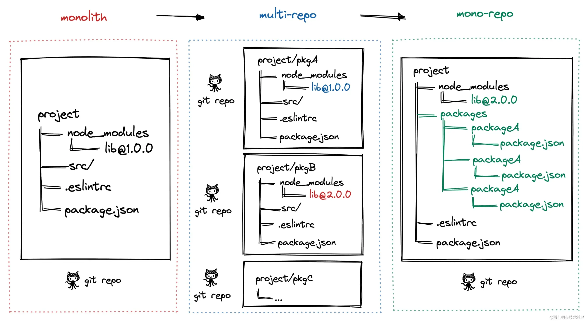

# 为何要使用 Monorepo？

Monorepo 是一种项目代码管理方式，指的是单个仓库中管理多个项目，有助于简化代码共享，版本控制，构建和部署等方面的复杂性，并提供更好的可重用性和协作性。

正常情况下，我们开发项目时都是采用一个项目一个目录，一个 git 地址，每个项目都是独立管理，开发，测试，发版，部署等。这种代码管理方式成为 MultiRepo，它使得代码管理简单，项目业务之间相互解耦，但是它也存在一些问题，随着业务复杂度提升，使得我们的仓库越来越多，使得工程管理起来变得复杂，并且跨仓库代码无法共享复用，依赖难以管理，编码风格，质量标准难以统一等

所以如果你的项目很大，模块很多，那么你可能需要使用 Monorepo 模式来管理项目代码
