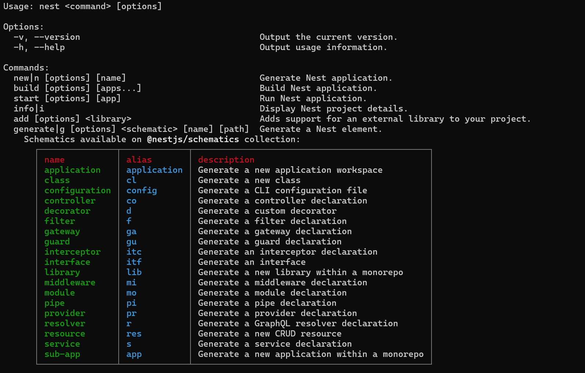
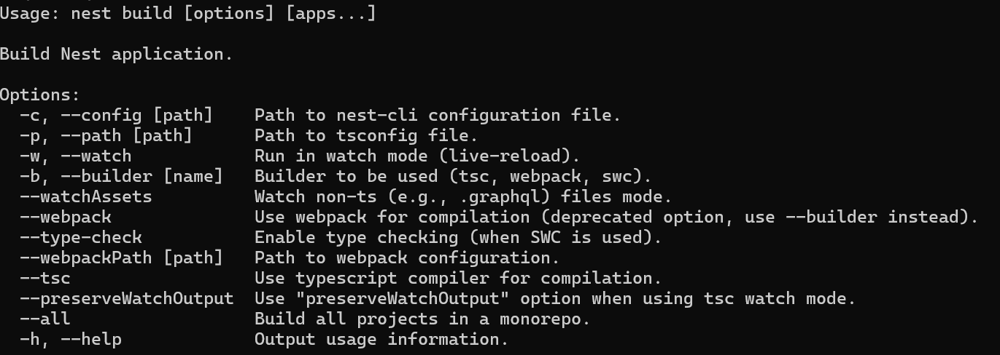
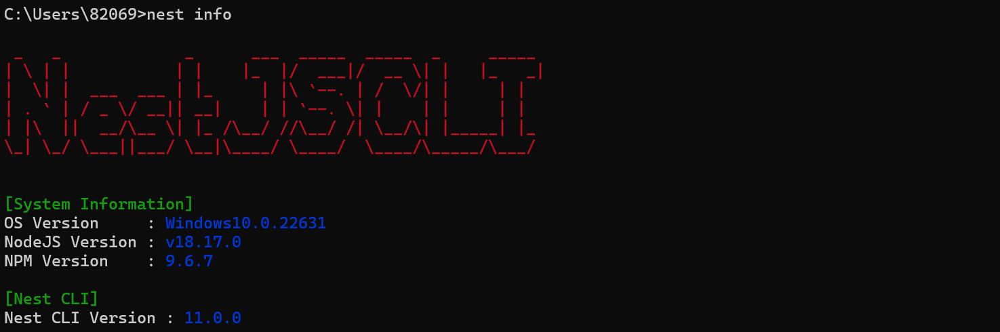
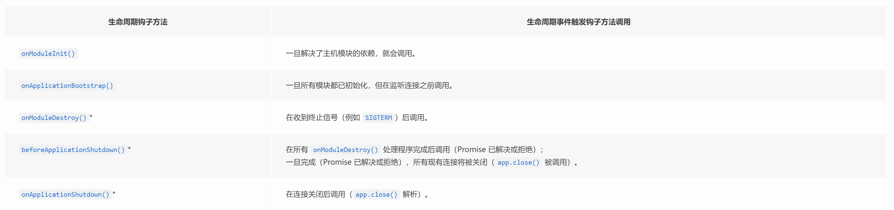
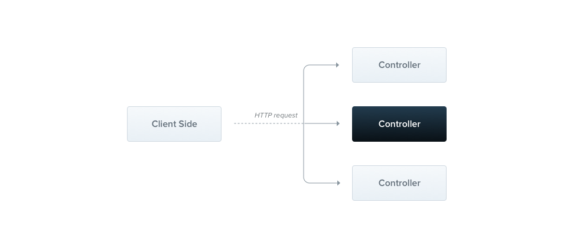

# NestJS

NestJS 是一个用于构建高效，可扩展的 Node.js 服务器端应用的框架

在幕后，Nest 使用强大的 HTTP 服务器框架，如 Express（默认），也可以选择配置为使用 Fastify!

Nest 在这些常见的 Node.js 框架之上提供了一个抽象级别，但也直接向开发者公开了它们的 API。这使开发者可以自由的使用可用于底层平台的无数第三方模块。

## 安装

可以直接 npx 执行

```js

npx @nestjs/cli new <project-name>

```

也可以先安装再执行创建新项目

```js

npm i -g @nestjs/cli
nest new <project-name>

```

## 升级

升级执行以下命令

```js

npm update -g @nestjs/cli

```

## 查看命令

```js
nest - h
```



## 常用命令

```js
nest new <project-name> 生成新项目

除了直接生成新项目，还可以生成项目中的部分代码如 controller service module 等

nest generate module <name> 生成模块
nest generate controller <name> 生成控制器
nest generate service <name> 生成提供器

也可以直接生成一个完整的模块代码
nest generate resource <name> 生成完整模块代码

nest build 构建项目
执行 build 的时候会有一些选项



其中--webpack 和--tsc 是用来指定用什么来编译
指定 webpack 的话会对项目进行打包，打包后的文件会放在 dist 目录下
指定 tsc 的话则不会打包，node 模块可以不进行打包，但是打包成单模块会提升加载的性能



nest info 查看项目信息 包括系统信息，node，npm 和依赖的版本
```

## 项目目录说明

```js
src
└─ app.controller.spec.ts 控制器的单元测试
├─ app.controller.ts 具有单一路由的基本控制器
└─ app.module.ts 应用的根模块
└─ app.service.ts 具有单一方法的基本服务
└─ main.ts 使用核心函数NestFactory创建Nest应用实例的应用入口文件

main.ts包含一个异步函数，它将引导我们的应用

import { NestFactory } from '@nestjs/core';
import { AppModule } from './app.module';
async function bootstrap() {
    const app = await NestFactory.create(AppModule);
    await app.listen(3000);
}
bootstrap();

NestFactory公开了一些允许创建应用实例的静态方法，`create()`方法返回了一个应用对象，它实现了INestApplication接口
```

## IOC(Inverse of Control)

IOC(控制反转)是一个容器，它的内部可以存放一些对象，在程序初始化的时候来扫描依赖关系，然后可以通过依赖注入（Dependency Injection）的方式向对象注入依赖，这样就完成了对象的创建和组装。
这样就解决了在后端程序中，各个对象之间错综复杂的关系处理问题。

在 nest 中我们通常使用装饰器来声明依赖

## 依赖注入

在 nest 中，如果模块 a 需要使用模块 b 中的 service 方法，则具体步骤是

1.在模块 b 中使用 exports 导出 bService

```js
import { Module } from '@nestjs/common'
import { BService } from './b.service'

@Module({
  providers: [BService],
  exports: [BService], // 导出BService
})
export class BModule {}
```

2.在模块 a 中使用 imports 导入 bMoudle

```js
import { Module } from '@nestjs/common'
import { AService } from './a.service'
import { BModule } from '../b/b.module' // 假设BModule位于不同的文件夹

@Module({
  imports: [BModule], // 导入BModule
  providers: [AService],
})
export class AModule {}
```

3.在模块 a 中注入 bService（可使用构造函数注入或者属性注入）

```js
import { Injectable, Inject } from '@nestjs/common';
import { BService } from '../b/b.service'; // 确保路径正确

@Injectable()
export class AService {
  //构造函数注入
  constructor(private readonly bService: BService) {}
  //属性注入
  @Inject("BService") private readonly bService: BService;
  // 示例方法
  async performTask() {
    return this.bService.someMethod();
  }
}
```

如果我们需要全局注册的话则使用 @Global 装饰器

```js

import { Module } from '@nestjs/common'
import { BService } from './b.service'

@Global()
@Module({
  providers: [BService],
  exports: [BService], // 导出BService
})
```

那么在需要注入的模块中则无须再使用 imports 来引用了
不过全局模块还是尽量少用，不然注入的很多 provider 都不知道来源，会降低代码的可维护性。

## 生命周期

Nest 在启动的时候，会递归解析 Module 依赖，扫描其中的 provider、controller，注入它的依赖。

全部解析完后，会监听网络端口，开始处理请求。




首先，递归初始化模块，会依次调用模块内的 controller、provider 的 onModuleInit 方法，然后再调用 module 的 onModuleInit 方法。

全部初始化完之后，再依次调用模块内的 controller、provider 的 onApplicationBootstrap 方法，然后调用 module 的 onApplicationBootstrap 方法

然后监听网络端口。

之后 Nest 应用就正常运行了。

## 控制器

控制器是负责处理传入请求并向客户端返回响应


路由机制控制哪个控制器接收哪些请求。通常每个控制器都不止一条路由，不同的路由可以执行不同的操作

```js
import { Controller, Get } from '@nestjs/common'
@Controller('cats')
export class CatsController {
  @Get() //告诉装饰器为get请求 如果是@Get('name')则将为GET /cats/name这样的请求生成路由映射
  findAll(@Req request: Request): string {
    return 'This action returns all cats'
  }
}
这里的@Controller 是定义基本控制器所必需的。'cats'是指定的可选路由路径前缀。在装饰器中使用路径前缀可以轻松对一组路由进行分组，并最大限度的减少重复代码。

当用户向此端点发送 get 请求时，Nest 将请求路由到我们自己定义的 findAll()方法。这里的方法名称是完全任意的。

```

::: info
要使用 CLI 创建控制器，只需执行 `nest g controller [name]`即可
如果是为了快速创建内置 validation 的 CRUD 控制器，可以使用`nest g controller [name]`
:::
