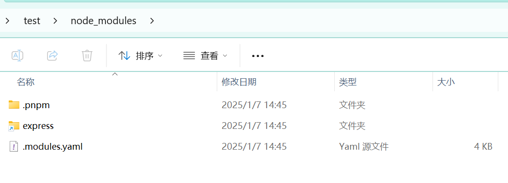
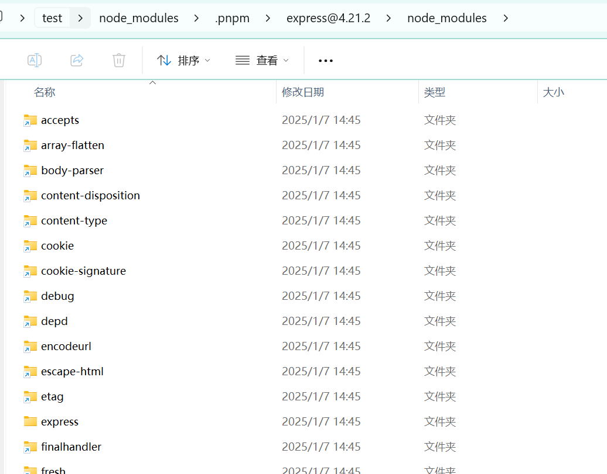
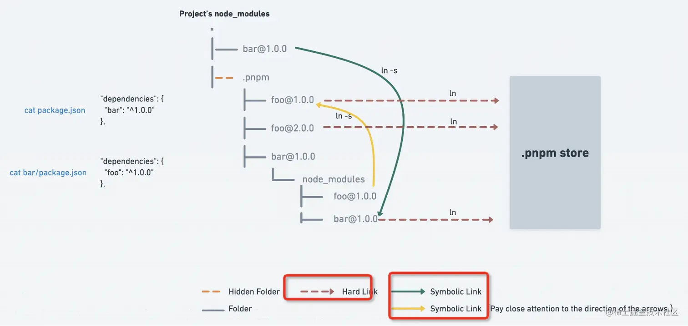
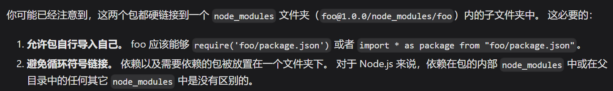

# 为何要使用 pnpm？

npm，yarn，pnpm 都是包管理工具，那么既然都是包管理工具，为何有了 npm 又出现了 yarn 呢，又为何有了 yarn 现在 pnpm 又火了起来呢？

## npm v2 的问题

从 npm 的历史发展来看，在 npm v2 及更早的版本，存在依赖嵌套问题，这是什么意思呢？当我安装一个包的时候，我们下载这个包并把这个包默认放在一个叫做 **node_modules** 的文件夹中，

当这个包也有自己的依赖的时候，那么在这个包的目录下也会出现一个 **node_modules** 文件夹，来放这个包的相关依赖，以此类推就像套娃一样，一层接着一层的套下去

```js
node_modules
└─ foo
   ├─ index.js
   ├─ package.json
   └─ node_modules
      └─ bar
         ├─ index.js
         └─ package.json
```

这会导致什么问题呢？

- **大量重复的包被安装导致占据大量的磁盘空间**，比如安装一个依赖 a,依赖 b 和 c，同时 b 和 c 有同时依赖 d，那么 d 依赖就会被重复安装两次
- **依赖层级太深**，导致文件路径过长，尤其是在 windows 系统下，会超出系统路径长度限制导致错误

同时 npm v2 安装依赖时还存在无法锁定版本号导致每次安装依赖都不同从而无法运行项目的问题

因此，npm v3 包括 yarn 都开始着手给依赖扁平化，并使用 yran.lock 或者 package.lock.json(npm v5.x 以上版本) 文件来锁定依赖版本

## npm v3 是完美的吗？

使用 npm v3 或者 yarn 来安装依赖时，node_modules 目录变成了下面这个样子

```js
node_modules
└─ foo
   ├─ index.js
   ├─ package.json
└─ bar
    ├─ index.js
    └─ package.json

```

没错，子包被拉平到和父包同一个目录

这是一个很好的思路，能够显著的节约磁盘空间，但是扁平化又带来了什么问题呢

- **依赖结构不清晰**，现在装一个包会把这个包的依赖强制拉平到和这个包同一层级，这会破坏依赖的结构
- **项目中可以非法访问子包**，也就是**幽灵依赖**。这是什么意思呢，想象一下，当我们安装了一个依赖 a，a 自身依赖 b，当把他们拉平时我们就可以直接引用 b，而这种访问其实是非法的。
- 依然存在嵌套**依赖嵌套**问题（依赖包有多个版本）

## pnpm 是如何解决上述问题的？

我们先来看 pnpm 的官网是如何介绍它的吧？


**快速、节省磁盘空间的包管理器**

首先是**快速**

前面说到的 yarn 也解决了 npm v2 安装速度慢的问题，它是怎么解决的呢？

- 使用**并行下载**加速依赖项的获取
- **缓存**每个下载过的包，检测是否这个包之前被缓存过，如果被缓存过，那么直接从缓存中重新安装这个包

那么 pnpm 又是如何提速和节省磁盘空间的呢

我们使用 pnpm 来安装一个依赖试一下

```js
pnpm install express
```



你会发现扁平的依赖结构消失了，现在 node_modules 目录下就只有 express 和一个.pnpm 文件夹了，如果你观察仔细的话你会发现 express 这个文件夹的左下角有一个箭头，这代表它是一个软连接

即使我们打开 express 文件夹也会发现这边非常的清爽干净


那么 pnpm 是如何准确识别子依赖呢？

我们打开.pnpm 文件夹


我们会发现 express 的所有依赖包都被安装到了这里，包括他自己


我们再继续往下打开，



会发现 express 的依赖都是以软连接的形式引入的

那么问题来了，这些依赖的真实地址在哪里呢

我们运行**pnpm store path**来查看一下


然后我们在资源管理器中打开这个地址看一下


我们会发现这个目录下多个很多的文件夹

这些都是基于 pnpm 的全局内容可寻址存储（CAS），是我们安装的依赖的真实文件

我们来看一张官方的图



从图中我们可以看出来 .pnpm 中的依赖都是硬链接到上面那个目录的全局仓库中的，而依赖之间的则是通过软链接来相互依赖的，这是一种非常巧妙的解决方案，它既解决了依赖打平以后出现**幽灵依赖的问题**，（因为当前的 node_modules 中确实只存在一个 express，他是通过软连接链接到.pnpm 中的 express），又解决了上面依赖嵌套带来的路径超长，占用磁盘空间等问题。

至于为什么每个依赖下都必须存在一个 node_modules 文件夹呢？,官方也对此作出了解释



## 如何使用 pnpm？

### 安装

```js
npm install -g pnpm
```

### 常见命令

```js
pnpm self-update //更新当前pnpm版本
pnpm config set store-dir /path/to/.pnpm-store //设置pnpm的存储目录
pnpm add <pkg> //安装依赖包
pnpm install //安装所有依赖
pnpm update //更新依赖
更新依赖时可以通过特定的模式匹配选择依赖项，如：
pnpm update "@babel/*" //更新所有的babel包
pnpm update --latest //更新所有的包到最新版本
pnpm remove <pkg> //删除依赖
```

其他命令请查看官网 https://pnpm.io/zh/
